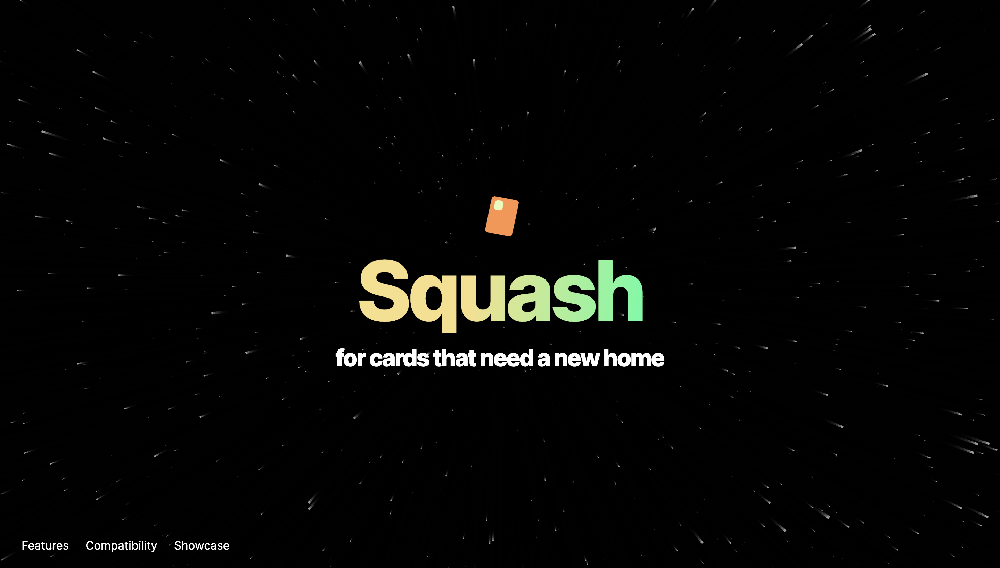

# Squash Cards

Squash is the first exchange that makes gift cards tradable. Enriching the world's most untapped asset class.

## Features

- 💨 Liquidity Pool Enabled Automated Market Maker
- 🪪 Any card, any amount
- 🔒 Risk-Free
- 🌎 Global

## Commands

| Command                | Action                                             |
| :--------------------- | :------------------------------------------------- |
| `npm install`          | Install dependencies                               |
| `npm run dev`          | Start local dev server at `localhost:3000`         |
| `npm run build`        | Build your production site to `./dist/`            |
| `npm run preview`      | Preview your build locally, before deploying       |
| `npm run astro ...`    | Run CLI commands like `astro add`, `astro preview` |
| `npm run astro --help` | Get help using the Astro CLI                       |
| `npm run format`       | Format code with [Prettier](https://prettier.io/)  |
| `npm run clean`        | Remove `node_modules` and build output             |

## Credits

- astronaut image
  - source: https://github.com/withastro/astro-og-image; note: this repo is not available anymore
- moon image
  - source: https://unsplash.com/@nasa
- other than that, a lot of material (showcase data, copy) was taken from official Astro sources, in particular https://astro.build/blog/introducing-astro/ and https://github.com/withastro/astro.build
